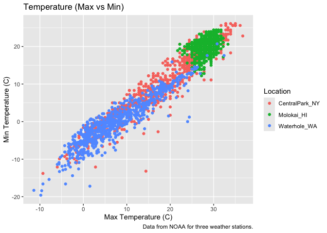
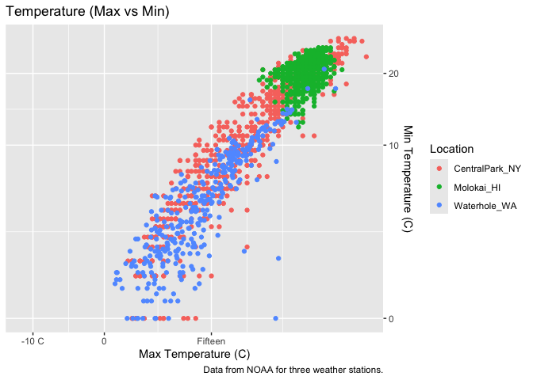
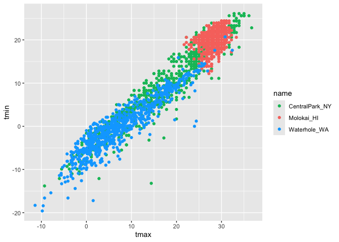
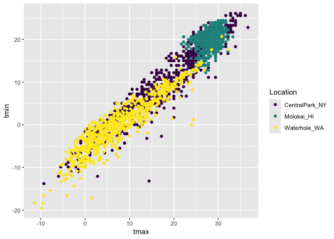
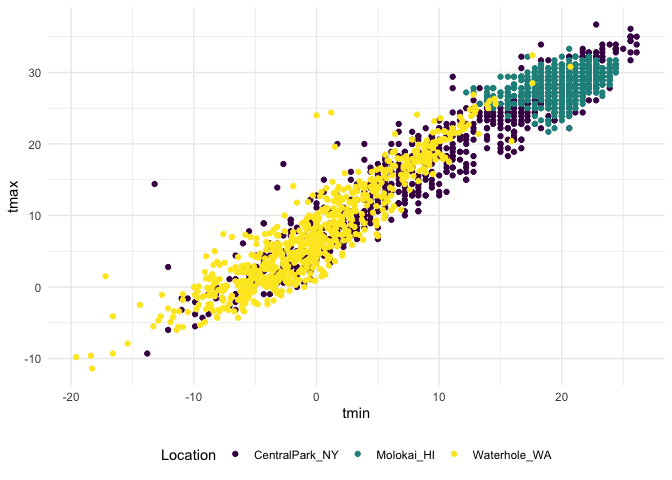
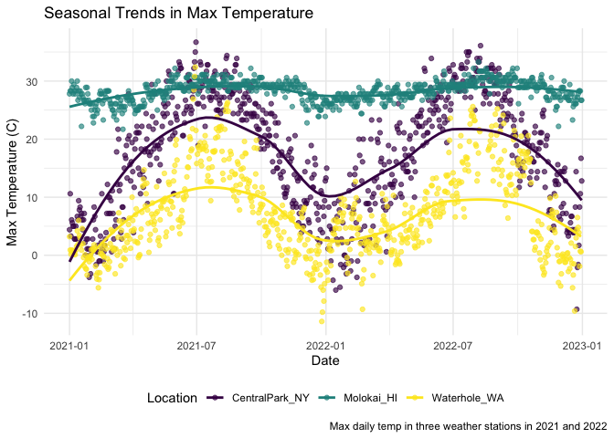
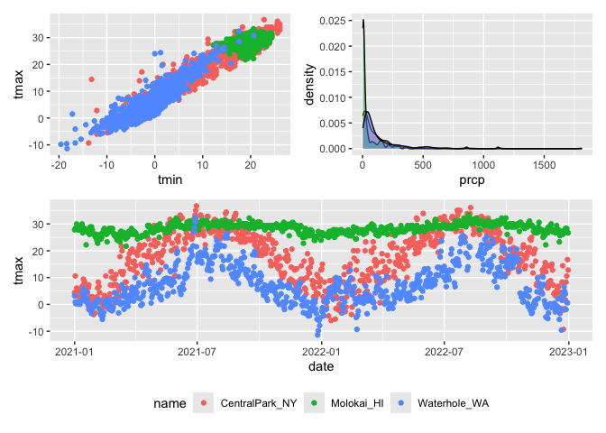
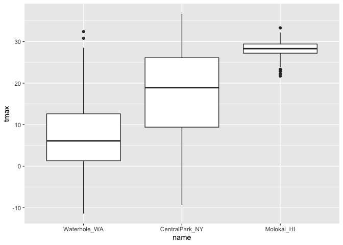
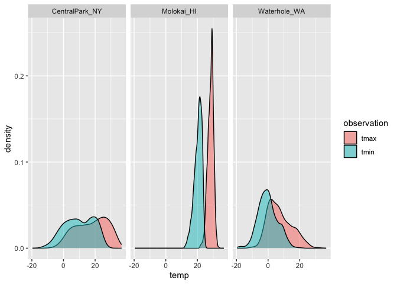

Visualization Part 2
================
Lauren Holley
2026-10-06

``` r
library(tidyverse)
library(patchwork)
library(p8105.datasets)
data("weather_df")
```

Starting with scatterplot:

``` r
weather_df |>
  ggplot(aes(x = tmax, y = tmin, color = name)) +
  geom_point() +
  labs(
    title = "Temperature (Max vs Min)",
    x = "Max Temperature (C)",
    y = "Min Temperature (C)",
    color = "Location",
    caption = "Data from NOAA for three weather stations."
  )
```

    ## Warning: Removed 17 rows containing missing values or values outside the scale range
    ## (`geom_point()`).

<!-- -->

Let’s try some other scales

``` r
weather_df |>
  ggplot(aes(x = tmax, y = tmin, color = name)) +
  geom_point() +
  labs(
    title = "Temperature (Max vs Min)",
    x = "Max Temperature (C)",
    y = "Min Temperature (C)",
    color = "Location",
    caption = "Data from NOAA for three weather stations."
  ) + 
  scale_x_continuous(
    breaks = c(-10, 0, 15),
    labels = c("-10 C", "0", "Fifteen")
  ) +
  scale_y_continuous(
    trans = "sqrt",
    position = "right"
  )
```

    ## Warning in transformation$transform(x): NaNs produced

    ## Warning in scale_y_continuous(trans = "sqrt", position = "right"): sqrt
    ## transformation introduced infinite values.

    ## Warning: Removed 520 rows containing missing values or values outside the scale range
    ## (`geom_point()`).

<!-- -->

`breaks` creates specific markings for the x axis labels/numbers

Let’s look at color

``` r
weather_df |>
  ggplot(aes(x = tmax, y = tmin, color = name)) +
  geom_point() +
  scale_color_hue(h = c(150, 600))
```

    ## Warning: Removed 17 rows containing missing values or values outside the scale range
    ## (`geom_point()`).

<!-- -->

``` r
weather_df |>
  ggplot(aes(x = tmax, y = tmin, color = name)) +
  geom_point() +
  viridis::scale_color_viridis(
    name = "Location",
    discrete = TRUE
  )
```

    ## Warning: Removed 17 rows containing missing values or values outside the scale range
    ## (`geom_point()`).

<!-- -->

## Themes

``` r
weather_df |>
  ggplot(aes(x = tmin, y = tmax, color = name)) +
  geom_point() +
  viridis::scale_color_viridis(
    name = "Location",
    discrete = TRUE
  ) +
  theme(legend.position = "bottom")
```

    ## Warning: Removed 17 rows containing missing values or values outside the scale range
    ## (`geom_point()`).

<!-- -->

``` r
weather_df |>
  ggplot(aes(x = tmin, y = tmax, color = name)) +
  geom_point() +
  viridis::scale_color_viridis(
    name = "Location",
    discrete = TRUE
  ) +
  theme_minimal() +
  theme(legend.position = "bottom")
```

    ## Warning: Removed 17 rows containing missing values or values outside the scale range
    ## (`geom_point()`).

<!-- -->

`bw` black + white bars `minimal` no outer outline `classic` no lines

all just through a `ggthemes` package — can look up other options online

Update the tmax vs date plot.

``` r
weather_df |>
  ggplot(aes(x = date, y = tmax, color = name)) +
  geom_point(alpha = 0.65) +
  geom_smooth(se = FALSE) +
  labs(
    title = "Seasonal Trends in Max Temperature",
    x = "Date",
    y = "Max Temperature (C)",
    caption = "Max daily temp in three weather stations in 2021 and 2022",
    color = "Location"
  ) +
  viridis::scale_color_viridis(
    discrete = TRUE
  ) +
  theme_minimal() +
  theme(legend.position = "bottom")
```

    ## `geom_smooth()` using method = 'loess' and formula = 'y ~ x'

    ## Warning: Removed 17 rows containing non-finite outside the scale range
    ## (`stat_smooth()`).

    ## Warning: Removed 17 rows containing missing values or values outside the scale range
    ## (`geom_point()`).

<!-- -->

## Two more weird but useful plot things

``` r
central_park_df =
  weather_df |>
  filter(name == "CentralPark_NY")

molokai_df =
  weather_df |>
  filter(name == "Molokai_HI")

ggplot(molokai_df, aes(x = date, y = tmax, color = name)) +
  geom_point() +
  geom_line(data = central_park_df)
```

    ## Warning: Removed 1 row containing missing values or values outside the scale range
    ## (`geom_point()`).

<!-- -->

Multiple panels with different plot types.

``` r
ggp_tmax_tmin = 
  weather_df |>
  ggplot(aes(x = tmin, y = tmax, color = name)) +
  geom_point() +
  theme(legend.position = "none")

ggp_prcp_density = 
  weather_df |>
  filter(prcp > 0) |>
  ggplot(aes(x = prcp, fill = name)) +
  geom_density(alpha = 0.5) +
  theme(legend.position = "none")

ggp_seasonal = 
  weather_df |>
  ggplot(aes(x = date, y = tmax, color = name)) +
  geom_point() +
  theme(legend.position = "bottom")

(ggp_tmax_tmin + ggp_prcp_density) / ggp_seasonal
```

    ## Warning: Removed 17 rows containing missing values or values outside the scale range
    ## (`geom_point()`).
    ## Removed 17 rows containing missing values or values outside the scale range
    ## (`geom_point()`).

<!-- -->

`+` next to each other `/` stacked on top of each other ^ these
functions are with the `library(patchwork)` package

## Data Manipulation

Start with factors.

boxplots

``` r
weather_df |>
  mutate(name = fct_relevel(name, c("Molokai_HI", "CentralPark_NY", "Waterhole_WA"))) |>
  ggplot(aes(x = name, y = tmax)) +
  geom_boxplot()
```

    ## Warning: Removed 17 rows containing non-finite outside the scale range
    ## (`stat_boxplot()`).

<!-- -->

``` r
weather_df |>
  mutate(name = fct_reorder(name, tmax)) |>
  ggplot(aes(x = name, y = tmax)) +
  geom_boxplot()
```

    ## Warning: There was 1 warning in `mutate()`.
    ## ℹ In argument: `name = fct_reorder(name, tmax)`.
    ## Caused by warning:
    ## ! `fct_reorder()` removing 17 missing values.
    ## ℹ Use `.na_rm = TRUE` to silence this message.
    ## ℹ Use `.na_rm = FALSE` to preserve NAs.

    ## Warning: Removed 17 rows containing non-finite outside the scale range
    ## (`stat_boxplot()`).

<!-- -->

Putting things in the right order is a factor problem not a `ggplot`
problem. This is things like which location we want to show first on the
graph.

Make that distribution plot:

``` r
weather_df |>
  select(name, tmax, tmin) |>
  pivot_longer(
    tmax:tmin,
    names_to = "observation",
    values_to = "temp"
  ) |>
  ggplot(aes(x = temp, fill = observation)) +
  geom_density(alpha = 0.5) +
  facet_grid(. ~ name)
```

    ## Warning: Removed 34 rows containing non-finite outside the scale range
    ## (`stat_density()`).

<!-- -->
